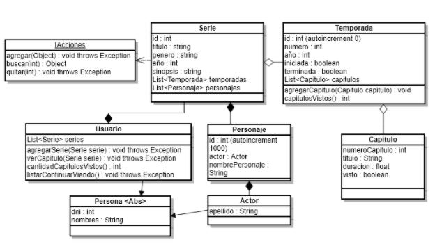

# Check

1) Generar la estructura y las clases indicadas en el diagrama con sus respectivas relaciones (Utilizar propiedades de acceso en cada clase).
   

2) Sobrecargar constructores, redefinir los métodos equals() y toString() en las clases.

3) Generar la estructura correspondiente 
   
Serie: (IAcciones)
   * agregar(Object) agrega una Temporada o un Personaje, en caso del Personaje validar que no exista previamente, de lo contrario, manejar el mensaje de error correspondiente.
   * buscar(int) retorna el objeto correspondiente en base al parámetro recibido, en caso de no existir, debe retornar null.
   * quitar(int) quita el objeto validando que exista, de lo contrario informar de error.

   Temporada:
   * agregarCapítulo(Capítulo cap) agrega un capítulo a la temporada.
   * capítulosVistos() retorna la cantidad de capítulos vistos en la temporada.
   * eliminar(int) Elimina la temporada completa, siempre y cuando nadie la este viendo en ese momento.En caso que alguien este mirando esta temporada manejar el error correspondiente.
    

4) El Usuario debe implementar los siguientes métodos:

   * agregarSerie(Serie serie) agrega la serie al listado validando que no exista previamente, caso contrario informar del error.
   * verCapitulo(Serie serie) marca como visto el siguiente capítulo de la temporada actual, en caso de haber completado la serie informe del error.
   * cantidadCapitulosVistos() retorna la cantidad total de capítulos vistos en todas las series. 
   * listarContinuarViendo() lista las series con tu temporada y capitulo a continuar viendo. En caso de no haber completado todas las series informar al usuario.
   Por ejemplo:
    * Serie [“Lost”] - Temporada [5] - Capítulo [10]
    * Serie [“Heroes”] - Temporada [2] - Capítulo [7]
